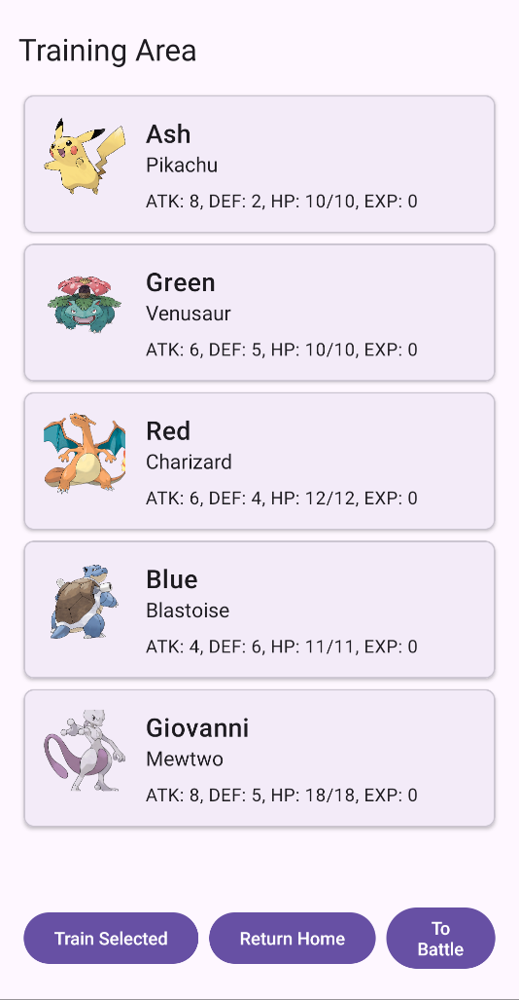
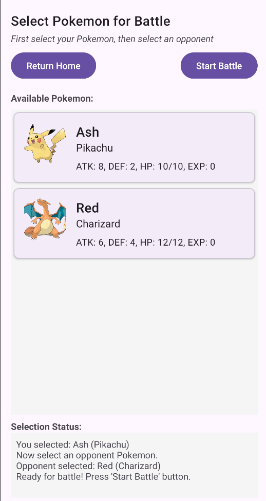
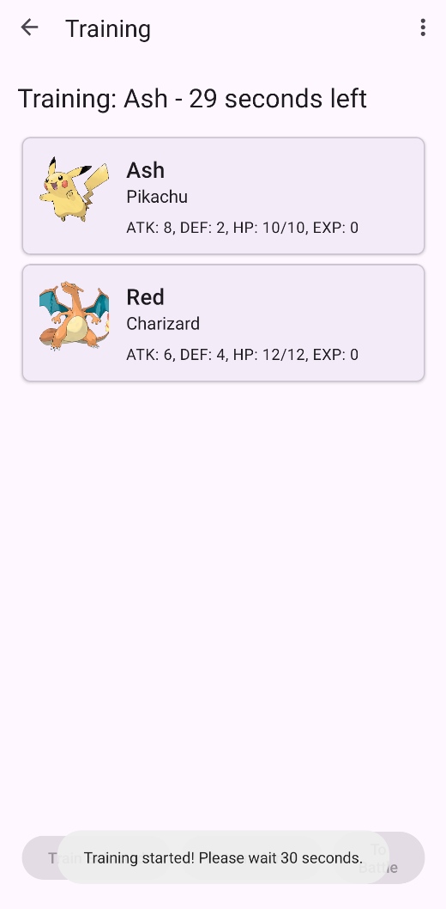
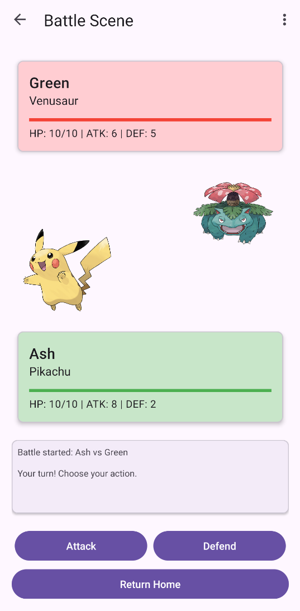

# Pokemon Battle Game 
Hi, my name is An Nguyen and this is my Pokemon game project for the OOP course.

## Build with
- Android Studio
- Java

## Basic features from requirements

#### Pokemon Management
- Users can create different types of Pokemons (Pikachu, Venusaur, Charizard, Blastoise, Mewtwo).
- Newly created Pokemons are placed in **Home**.
- Users can move Pokemons to training areas or battle arenas.

#### Training System
- Pokemons gain experience points when trained.
- Experience increases attack power (e.g., if XP = 2, attack increases by 2 points)

#### Turn-Based Battle System
- Users can select two Pokemons to baHle.
- Batlles follow a turn-based system:
  - One Pokemon attacks, the other defends.
  - The batlle continues until one Pokemon’s health drops to zero.
  - The winner gains an experience point.
  - The loser is move to Home then healed.

## Bonus features 

#### RecyclerView: 
- Uses the RecyclerView component to list Pokemons and their details.

#### Pokemons Have Images

  

#### Battle Visualization
- Animated GIF specifically for each Pokemon when they attack.

#### Turn-based combat
- The player controls the Pokemon’s actions each batlle turn. The other Pokeemon can automatically act (only attack) and your own Pokemon acts as you choose.
- Each Pokemon will have their own skill name (both attack and defend) and will be show in battle log message.

#### Statistics
- Pokemon's win/loss/training days stat will be show in **Statistics** view which can be access from **Home**.

#### No death
- As mentioned before, *The loser is move to Home then healed*.

#### Randomness in Battles
##### **Pikachu’s Unique Damage System:**  _Because he is the main character's main Pokemon xD_
- Pikachu’s attack has three possible outcomes (each with 1/3 chance):
  - Miss (0x damage)
  - Normal hit (1x damage)
  - Critical hit (2x damage)

#### Data Storage and Loading
- Save all Pokemon created in Home into a CSV file, then load when needed.

#### Statistics Visualization
- Using AnyChart-Android for pie chart win rate ratio for each Pokemon.

## Custom feature

### General
- As the original concept is LUTemon, I have changed to Pokemon so that we have 5 species as above and also attack/defend name skills.
- Give ***Selection Status*** when choosing Pokemon for battle.

  

### Training
- Set a timer for a Pokemon when training; it will raise a cooldown clock for training (Base is 30s).

  

### In-battle Mechanism
- **Defend** will increase your Pokemon defense +2 for one round.

### User Interface
- New battle UI with **Health bar** and different animated GIF for **Battle effect** when Pokemon use their skill.

  

## AI and Plagiarism
- I have partly used AI (Claude 3.7 Sonnet) for
  - ***StatisticsFragment*** (Handle tracking number of battles, victories, training days,... and winrate chart)
  - ***Load/Save data from CSV files***
  - Checking comments and JavaDoc of functions.
- Battle UI inspired by https://github.com/hcupiter/Pokemon
## License
This project is created for educational purposes as part of the OOP course.

## Author
An Nguyen
